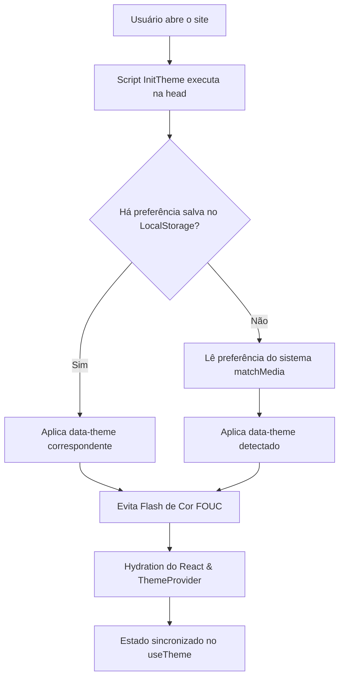
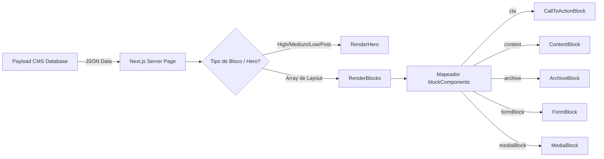

# Auditoria da Arquitetura Visual e Guia de Design System

Este documento fornece uma análise técnica detalhada do sistema visual, padrões de estilização, componentes de interface, integrações com o CMS e governança visual do projeto **kayro-gomes**. 

---

## 1. Arquitetura do Design System

O projeto utiliza uma arquitetura moderna e otimizada baseada no **Tailwind CSS v4** (através de `@import 'tailwindcss'` no CSS principal) combinada com variáveis CSS locais declaradas em formato **OKLCH** para o gerenciamento de cores perceptualmente uniformes.

### Localização das Definições
* **Estilos Globais e Variáveis CSS:** [globals.css](file:///home/kayro/kayro-gomes/src/app/(frontend)/globals.css) é a **fonte única da verdade** para todos os tokens de design (cores, raios de borda, fontes, etc.).
* **Configurações de Extensão (Prose/Typography):** [tailwind.config.mjs](file:///home/kayro/kayro-gomes/tailwind.config.mjs) estende a tipografia do plugin `@tailwindcss/typography` para layouts ricos em texto.
* **Mapeamento de Breakpoints para JS:** [cssVariables.js](file:///home/kayro/kayro-gomes/src/cssVariables.js) expõe os breakpoints para scripts client-side.

### Tokens de Design e Variáveis Globais

#### A. Sistema de Cores (OKLCH)
A paleta de cores é inteiramente declarada em variáveis CSS nativas usando o espaço de cor `oklch()`, o que garante gradientes matematicamente equilibrados e conformidade com acessibilidade visual (WCAG).

| Token | CSS Variable | Light Mode | Dark Mode |
|---|---|---|---|
| Background | `--background` | `oklch(100% 0 0deg)` (Branco) | `oklch(14.5% 0 0deg)` (Preto Asfalto) |
| Foreground | `--foreground` | `oklch(14.5% 0 0deg)` (Cinza Escuro) | `oklch(98.5% 0 0deg)` (Branco Gelo) |
| Card | `--card` | `oklch(96.5% 0.005 265deg)` | `oklch(17% 0 0deg)` |
| Primary | `--primary` | `oklch(20.5% 0 0deg)` | `oklch(98.5% 0 0deg)` |
| Secondary | `--secondary` | `oklch(97% 0 0deg)` | `oklch(26.9% 0 0deg)` |
| Muted | `--muted` | `oklch(97% 0 0deg)` | `oklch(26.9% 0 0deg)` |
| Border | `--border` | `oklch(92.2% 0 0deg)` | `oklch(26.9% 0 0deg)` |
| Destructive | `--destructive` | `oklch(57.7% 0.245 27.325deg)` | `oklch(39.6% 0.141 25.723deg)` |
| Success | `--success` | `oklch(78% 0.08 200deg)` | `oklch(28% 0.1 200deg)` |
| Warning | `--warning` | `oklch(89% 0.1 75deg)` | `oklch(35% 0.08 70deg)` |
| Error | `--error` | `oklch(75% 0.15 25deg)` | `oklch(45% 0.1 25deg)` |

#### B. Tipografia
Carregada via pacote `geist` para obter performance máxima de fontes variáveis sem dependências de rede.
* **Sans-Serif:** `GeistSans` mapeada para a variável CSS `--font-sans`.
* **Monospace:** `GeistMono` mapeada para a variável CSS `--font-mono`.
* Ambos os tokens são injetados no elemento `<html>` via classes utilitárias de variáveis geradas pelo Next.js (`GeistSans.variable` e `GeistMono.variable`).

#### C. Escala de Espaçamento e Margens
* Baseada puramente nas escalas padrão do Tailwind CSS (unidades de `rem`).
* As estruturas principais usam margens verticais consistentes como `my-16` (64px) e paddings como `py-8` (32px) para seções internas.

#### D. Grid e Breakpoints
Os breakpoints no arquivo CSS são definidos através de aliases de tema no Tailwind v4:
* `sm`: `40rem` (640px)
* `md`: `48rem` (768px)
* `lg`: `64rem` (1024px)
* `xl`: `80rem` (1280px)
* `2xl`: `86rem` (1376px)

> [!WARNING]
> **Inconsistência Identificada:** Breakpoints definidos no arquivo JavaScript [cssVariables.js](file:///home/kayro/kayro-gomes/src/cssVariables.js) diferem levemente dos valores definidos no CSS (`2xl` mapeia para `1536px` no JS e `1376px` no CSS; e existe um breakpoint `3xl: 1920px` que não está configurado no CSS global). Veja a seção de refatoração para mais detalhes.

#### E. Raios de Borda (Border Radius)
* Token Base: `--radius: 0.625rem` (10px).
* Derivados configurados no `@theme inline`:
  * `--radius-sm`: `calc(var(--radius) - 4px)` (6px)
  * `--radius-md`: `calc(var(--radius) - 2px)` (8px)
  * `--radius-lg`: `var(--radius)` (10px)
  * `--radius-xl`: `calc(var(--radius) + 4px)` (14px)

#### F. Z-Index
Utilizado de forma enxuta para controle de sobreposição:
* `z-10`: Elementos internos de heros contendo texto.
* `z-20`: Header de navegação (`header.container`).
* `z-50` / `z-100`: Componentes suspensos (Select Popover e skip links acessíveis).

#### G. Estados Visuais (Foco, Hover e Invalidez)
* **Foco Acessível (Focus outline):** `:focus-visible` aplica `outline: 2px solid var(--ring)` e `outline-offset: 2px` (ou `3px` para botões e links) garantindo acessibilidade a teclados.
* **Hover:** Efeitos suaves de opacidade e variação de cor (ex: `hover:bg-primary/90` ou `hover:bg-white/10`).
* **Invalidez (Aria Invalid):** O estado de erro foca sem borda de ring (`aria-invalid:focus-visible:ring-0`).

---

## 2. Sistema de Temas

O projeto conta com suporte nativo a temas **Claro (Light)** e **Escuro (Dark)**.



### Mecanismo de Funcionamento e Aplicação
1. **Script de Inicialização Bloqueante (`InitTheme`):** Injetado de maneira síncrona no `<head>` ([InitTheme/index.tsx](file:///home/kayro/kayro-gomes/src/providers/Theme/InitTheme/index.tsx)). Este script lê a chave `payload-theme` no `localStorage` antes de renderizar o HTML. Caso não exista, ele faz um fallback para `window.matchMedia('(prefers-color-scheme: dark)')`.
2. **Atributo HTML:** O script seta `data-theme="light"` ou `data-theme="dark"` no elemento `<html>`.
3. **Mapeamento de Seletores CSS:** No arquivo [globals.css](file:///home/kayro/kayro-gomes/src/app/(frontend)/globals.css), as variáveis do tema claro vivem sob o seletor `:root`. Quando `data-theme="dark"` é aplicado, os tokens sob o bloco `[data-theme='dark']` sobrescrevem as variáveis globais.
4. **Custom Variant do Tailwind v4:** Criada no topo do arquivo CSS global:
   ```css
   @custom-variant dark (&:is([data-theme='dark'] *));
   ```
   Isso permite que classes contendo prefixo `dark:` (ex: `dark:bg-card`) sejam aplicadas apenas quando um ancestral possuir o atributo `data-theme='dark'`.
5. **Transições Globais Suaves:** Transições de cor de fundo e bordas são aplicadas de forma global para garantir suavidade na alternância de temas:
   ```css
   html {
     transition: background-color 200ms ease, color 200ms ease;
   }
   html * {
     transition: background-color 200ms ease, border-color 200ms ease, color 100ms ease;
   }
   ```

---

## 3. Auditoria de Componentes

### Mapeamento Técnico de Componentes Públicos

#### 1. Header (Componente Servidor + Cliente)
* **Responsabilidade:** Renderizar a barra de navegação global superior, incluindo o logotipo dinâmico e links cadastrados no CMS.
* **Localização:** [src/Header](file:///home/kayro/kayro-gomes/src/Header)
* **Dependências:** `useHeaderTheme` (para forçar tema escuro em páginas específicas como posts ou heros de alto impacto), `Logo`, `HeaderNav`.
* **Integração CMS:** Consome a global `header` via helper de cache do Payload.

#### 2. Footer (Componente Servidor)
* **Responsabilidade:** Renderizar as informações e navegação do rodapé, incluindo o controle de alteração de temas.
* **Localização:** [src/Footer](file:///home/kayro/kayro-gomes/src/Footer)
* **Dependências:** `ThemeSelector`, `CMSLink`, `Logo`.
* **Integração CMS:** Consome a global `footer` para renderizar `navItems`.

#### 3. Card (Componente Cliente)
* **Responsabilidade:** Renderizar prévias de artigos (posts) com suporte a container clicável acessível.
* **Localização:** [src/components/Card](file:///home/kayro/kayro-gomes/src/components/Card)
* **Dependências:** `useClickableCard`, `Media`, `Link`.
* **Integração CMS:** Consome os campos `slug`, `categories`, `meta` e `title` da coleção `posts`.

#### 4. ProjectCard (Componente Cliente)
* **Responsabilidade:** Renderizar prévias de projetos, mostrando tags de tecnologia e descrição curta.
* **Localização:** [src/components/ProjectCard](file:///home/kayro/kayro-gomes/src/components/ProjectCard)
* **Dependências:** `useClickableCard`, `Media`, `Link`.
* **Integração CMS:** Consome dados da coleção `projects` (slug, title, summary, tech list, coverImage).

#### 5. CollectionArchive (Componente Cliente)
* **Responsabilidade:** Renderizar um grid responsivo de posts e gerenciar layout interno.
* **Localização:** [src/components/CollectionArchive](file:///home/kayro/kayro-gomes/src/components/CollectionArchive)
* **Dependências:** `Card`.

#### 6. ProjectGrid (Componente Servidor/Cliente)
* **Responsabilidade:** Exibir os projetos cadastrados organizados em colunas flexíveis.
* **Localização:** [src/components/ProjectGrid](file:///home/kayro/kayro-gomes/src/components/ProjectGrid)
* **Dependências:** `ProjectCard`.

#### 7. CMSLink (Componente Cliente)
* **Responsabilidade:** Link dinâmico polimórfico. Pode renderizar como link inline clássico ou envolto no componente de botão Shadcn dependendo da propriedade `appearance`.
* **Localização:** [src/components/Link](file:///home/kayro/kayro-gomes/src/components/Link)
* **Dependências:** `Button` (Shadcn UI).

#### 8. RichText (Componente Cliente)
* **Responsabilidade:** Converter os dados do editor Lexical do Payload CMS em elementos estruturados do React.
* **Localização:** [src/components/RichText](file:///home/kayro/kayro-gomes/src/components/RichText)
* **Dependências:** `@payloadcms/richtext-lexical`, `BannerBlock`, `CodeBlock`, `CallToActionBlock`, `MediaBlock`.
* **Integração CMS:** Age como processador principal para os blocos de texto rico e injeta renderizações personalizadas de blocos lexicais internos (`banner`, `mediaBlock`, `code`, `cta`).

---

### Diagnóstico de Problemas e Inconsistências (Resolvido)

Todas as inconsistências identificadas na auditoria inicial foram resolvidas com sucesso seguindo as diretrizes oficiais:

1. **Duplicação de Estruturas de Card (Resolvido):**
   * *Correção:* Os componentes [Card/index.tsx](file:///home/kayro/kayro-gomes/src/components/Card/index.tsx) e [ProjectCard/index.tsx](file:///home/kayro/kayro-gomes/src/components/ProjectCard/index.tsx) foram refatorados para utilizar a primitiva de layout `Card` do Shadcn UI (`src/components/ui/card.tsx`), garantindo consistência total de bordas, raios e sombras.
   * *Melhoria:* Removemos a string hardcoded `"No image"` nos cards sem imagem de capa, substituindo por um contêiner de fallback sutil e elegante (`bg-muted/10`).
2. **Textos e Mensagens Hardcoded (Resolvido):**
   * *Correção:*
     * A tela de busca vazia em [search/page.tsx](file:///home/kayro/kayro-gomes/src/app/(frontend)/search/page.tsx) foi redesenhada usando um estado vazio detalhado com bordas tracejadas e fontes secundárias da escala.
     * Os estados de carregamento e erro do formulário em [Form/Component.tsx](file:///home/kayro/kayro-gomes/src/blocks/Form/Component.tsx) foram encapsulados em contêineres de feedback estilizados e semânticos (com o ícone animado `Loader2` de `lucide-react` para carregamento e caixa destrutiva com tema de erro para falhas).
3. **Inconsistência de Classes Utilitárias (Resolvido):**
   * *Correção:* O componente [RelatedPosts/Component.tsx](file:///home/kayro/kayro-gomes/src/blocks/RelatedPosts/Component.tsx) foi atualizado para utilizar o utilitário padronizado do projeto `cn` em vez da biblioteca `clsx` isolada, prevenindo possíveis conflitos de mesclagem de classes do Tailwind CSS. Também padronizamos a importação relativa da pasta de componentes utilizando o alias `@/components/Card`.

---

## 4. Estrutura de Layouts e Templates

O Next.js organiza as páginas do site na pasta `src/app/(frontend)`. 

### Hierarquia de Composição
1. **RootLayout ([layout.tsx](file:///home/kayro/kayro-gomes/src/app/(frontend)/layout.tsx)):** 
   * Controla a estrutura base do documento (`<html>`, `<head>`, `<body>`).
   * Adiciona fontes variáveis Geist (`GeistSans` e `GeistMono`).
   * Insere o script de bloqueio do tema `InitTheme`.
   * Envolve a aplicação nos provedores globais (`Providers`).
   * Renderiza os elementos estáticos e semânticos: `<Header />`, `<main id="main">{children}</main>` e `<Footer />`.
2. **Páginas Dinâmicas ([[slug]/page.tsx](file:///home/kayro/kayro-gomes/src/app/(frontend)/[slug]/page.tsx)):**
   * Roteador de conteúdo CMS. Carrega os metadados do SEO e constrói o topo da página através do `RenderHero` e os blocos dinâmicos subsequentes pelo `RenderBlocks`.
3. **Páginas de Detalhes de Projetos ([projetos/[slug]/page.tsx](file:///home/kayro/kayro-gomes/src/app/(frontend)/projetos/[slug]/page.tsx)):**
   * Estruturada sob medida para exibir metadados do portfólio (Stack, links do projeto ao vivo/repositório e capa ampla no topo) usando o `<ProjectHero />` e renderizando a descrição longa via `<RichText />`.
4. **Páginas de Posts/Artigos ([posts/[slug]/page.tsx](file:///home/kayro/kayro-gomes/src/app/(frontend)/posts/[slug]/page.tsx)):**
   * Utiliza `<PostHero />`, exibe dados de autoria e publicação, renderiza o artigo com `<RichText />` e exibe artigos relacionados através do componente `<RelatedPosts />`.

---

## 5. Padrões de Estilos e Análise CSS

### `@source inline` no Tailwind v4
Uma das técnicas mais importantes no projeto é o uso de diretivas `@source inline` no [globals.css](file:///home/kayro/kayro-gomes/src/app/(frontend)/globals.css) para evitar a exclusão de classes que são geradas de forma dinâmica no JavaScript.

```css
@source inline("lg:col-span-4");
@source inline("lg:col-span-6");
@source inline("lg:col-span-8");
@source inline("lg:col-span-12");
```

Isso garante que as classes dinâmicas computadas em [ContentBlock/Component.tsx](file:///home/kayro/kayro-gomes/src/blocks/Content/Component.tsx) (onde as larguras das colunas são determinadas dinamicamente a partir dos campos do Payload) não sofram tree-shaking pelo compilador do Tailwind CSS v4.

### Pontos Críticos e Otimizações de Estilo
* **Transição Universal Otimizada (Resolvido):** A antiga regra de transição agressiva (`html *`) no globals.css foi removida. Em seu lugar, as transições suaves de cor de fundo, bordas e texto foram direcionadas especificamente para a lista de seletores do layout principal e elementos interativos da DOM, otimizando drasticamente o consumo de processamento da CPU.
* **Estilos Inline Fallback:** No Header (`Component.client.tsx`), os atributos de tema são injetados em formato dinâmico inline: `theme ? { 'data-theme': theme } : {}`. Isso é correto e garante o isolamento do tema no Header caso a página mude de contexto de cor.

---

## 6. Sistema de Animações

> [!IMPORTANT]
> **Descoberta Importante da Auditoria:** O projeto **não possui** a biblioteca `framer-motion` instalada em suas dependências. Toda e qualquer animação ou transição no site ocorre por meio de **classes de transição nativa do CSS** e dos utilitários do pacote **`tw-animate-css`** (baseado em animações css declarativas integradas ao Tailwind).

### Mecanismos de Animação Utilizados
1. **Transição de Estados com CSS Nativo:**
   * Utilizado para hover em botões, links, cards e trocas de temas (`transition-[color,box-shadow]` e `transition-all duration-200`).
2. **Animações de Entrada (Radix UI + Animate):**
   * Configurado nos componentes interativos do Shadcn UI como dropdowns de seleção (ver [select.tsx](file:///home/kayro/kayro-gomes/src/components/ui/select.tsx)):
     * Entrada: `data-[state=open]:animate-in data-[state=open]:fade-in-0 data-[state=open]:zoom-in-95`
     * Saída: `data-[state=closed]:animate-out data-[state=closed]:fade-out-0 data-[state=closed]:zoom-out-95`

---

## 7. Integração Visual com o CMS

A renderização visual é acoplada diretamente à estrutura de dados entregue pelo Payload CMS. O fluxo de transformação segue um padrão declarativo bem definido.



### Mecanismo de Renderização e Controlo
1. **Roteamento de Layout:** O campo `layout` nas coleções do CMS aceita uma matriz de blocos dinâmicos (`blocks`). O componente `<RenderBlocks />` analisa o atributo `blockType` de cada item e monta sequencialmente a página invocando o componente visual React correspondente.
2. **Controle de Layout via CMS:**
   * No `ContentBlock`, o CMS fornece o tamanho da coluna (`full`, `half`, `oneThird`, `twoThirds`) que dita o grid tailwind (`col-span-*`).
   * No `BannerBlock`, o CMS fornece o estilo visual (`info`, `error`, `success`, `warning`) que dita as bordas e fundos em OKLCH do banner no frontend.
   * No `MediaBlock`, opções de margem (`enableGutter`) e exibição de legendas são definidas pelo CMS.

---

## 8. Guia de Governança e Evolução

Para manter o Design System íntegro e garantir regressão zero nos estilos, siga as instruções operacionais abaixo para realizar alterações comuns no ecossistema de interface.

### A. Como Adicionar ou Editar Cores
1. **Local:** Vá até `:root` ou `[data-theme='dark']` no arquivo [globals.css](file:///home/kayro/kayro-gomes/src/app/(frontend)/globals.css).
2. **Padrão:** Calcule a cor no formato **OKLCH** (Luminância, Croma, Matiz).
3. **Mapeamento:** Adicione a variável no `@theme inline` para torná-la uma classe utilitária do Tailwind (ex: `--color-minha-cor: var(--minha-cor)`).
4. **Regra:** Nunca hardcodeie valores HEX ou RGB diretamente nos arquivos React. Use sempre `bg-primary`, `text-muted-foreground`, etc.

### B. Como Adicionar Novos Componentes de UI (via Shadcn)
1. **Comando:** Utilize o Bun para instalar componentes Shadcn UI:
   ```bash
   bunx --bun shadcn@latest add <componente>
   ```
2. **Pós-instalação:** Valide se o novo arquivo em `src/components/ui/` consome os tokens existentes (como `bg-background`, `border-input`) e utiliza o utilitário `cn(...)` importado de `@/utilities/ui`.

### C. Como Criar um Novo Bloco do CMS
1. **Configuração do Payload:**
   * Crie o arquivo de definição de campos do bloco em `src/blocks/<NovoBloco>/config.ts` exportando um objeto do tipo `Block`.
   * Registre o bloco na coleção `Pages` em [Pages/index.ts](file:///home/kayro/kayro-gomes/src/collections/Pages/index.ts) sob a propriedade `blocks`.
2. **Componente Visual:**
   * Crie o arquivo visual `src/blocks/<NovoBloco>/Component.tsx`.
   * Certifique-se de que os estilos consumam puramente variáveis utilitárias do Tailwind e respeitem o espaçamento vertical global.
3. **Registro no Renderizador:**
   * Vá em [RenderBlocks.tsx](file:///home/kayro/kayro-gomes/src/blocks/RenderBlocks.tsx), importe o novo componente visual e adicione a chave correspondente ao mapeador `blockComponents`.

---

## 9. Relatório Final e Plano de Ação

### Mapa Completo da Arquitetura Visual

```
📂 src/
┣ 📂 app/(frontend)/
┃ ┣ 📜 globals.css              <-- Fonte única de tokens, estilos base e temas (Tailwind v4)
┃ ┣ 📜 layout.tsx               <-- Estrutura de casca principal, fontes, scripts globais
┃ ┗ 📜 page.tsx                 <-- Ponto de entrada padrão
┣ 📂 providers/
┃ ┣ 📂 Theme/
┃ ┃ ┣ 📂 InitTheme/             <-- Script anti-FOUC bloqueante de cabeçalho
┃ ┃ ┣ 📂 ThemeSelector/         <-- Dropdown do seletor visual de tema (Auto/Light/Dark)
┃ ┃ ┗ 📜 index.tsx              <-- Contexto React de tema client-side
┃ ┗ 📂 HeaderTheme/             <-- Contexto para alteração do tema do cabeçalho
┣ 📂 components/
┃ ┣ 📂 ui/                      <-- Primitivas agnósticas (Shadcn UI)
┃ ┣ 📂 Card/                    <-- Componente visual de post
┃ ┣ 📂 ProjectCard/             <-- Componente visual de projeto
┃ ┣ 📂 Link/                    <-- Link polimórfico CMS
┃ ┗ 📂 RichText/                <-- Parser de dados Lexical do CMS
┣ 📂 blocks/
┃ ┣ 📜 RenderBlocks.tsx         <-- Roteador de blocos dinâmicos do CMS
┃ ┗ 📂 <BlockName>/             <-- Blocos individuais de conteúdo
┗ 📂 heros/
  ┣ 📜 RenderHero.tsx           <-- Roteador de heros dinâmicos do CMS
  ┗ 📂 <HeroName>/              <-- Heros individuais
```

### Status de Resolução dos Problemas e Inconsistências
1. **Definições Duplicadas de Breakpoints (Resolvido):** Os breakpoints definidos no JavaScript ([cssVariables.js](file:///home/kayro/kayro-gomes/src/cssVariables.js)) foram alinhados exatamente com os valores reais configurados no CSS do Tailwind v4 (`2xl` configurado para `1376` / `86rem` e remoção da chave redundante `3xl`).
2. **Duplicidade Estrutural nos Cards (Resolvido):** `Card` e `ProjectCard` foram consolidados para usar o componente semântico de `Card` do Shadcn UI.
3. **Uso Indireto de `clsx` (Resolvido):** `RelatedPosts` agora usa o utilitário padronizado `cn` e caminhos com aliases `@/`.
4. **Seletor Universal de Transição Agressivo (Resolvido):** A transição universal foi substituída por regras explícitas para seletores de layout e elementos interativos.

### Histórico de Execuções e Testes de Verificação
O plano de refatoração foi executado e aprovado com sucesso:
* **Passo 1 (Breakpoints):** Alinhamento executado no `src/cssVariables.js`.
* **Passo 2 (Transições):** Refatoração da performance de transições aplicada em `globals.css`.
* **Passo 3 (Imports & Estilização):** Correções aplicadas no `RelatedPosts/Component.tsx`.
* **Passo 4 (Cards & Feedbacks):** Refatoração completa de `Card`, `ProjectCard`, `search/page.tsx` e `Form/Component.tsx`.
* **Validação Geral:** Execução de `bun run lint` (ESLint limpo), `bunx tsc --noEmit` (TypeScript 100% livre de erros) e `bunx next build` (compilação e otimização de páginas de produção completada com sucesso).
