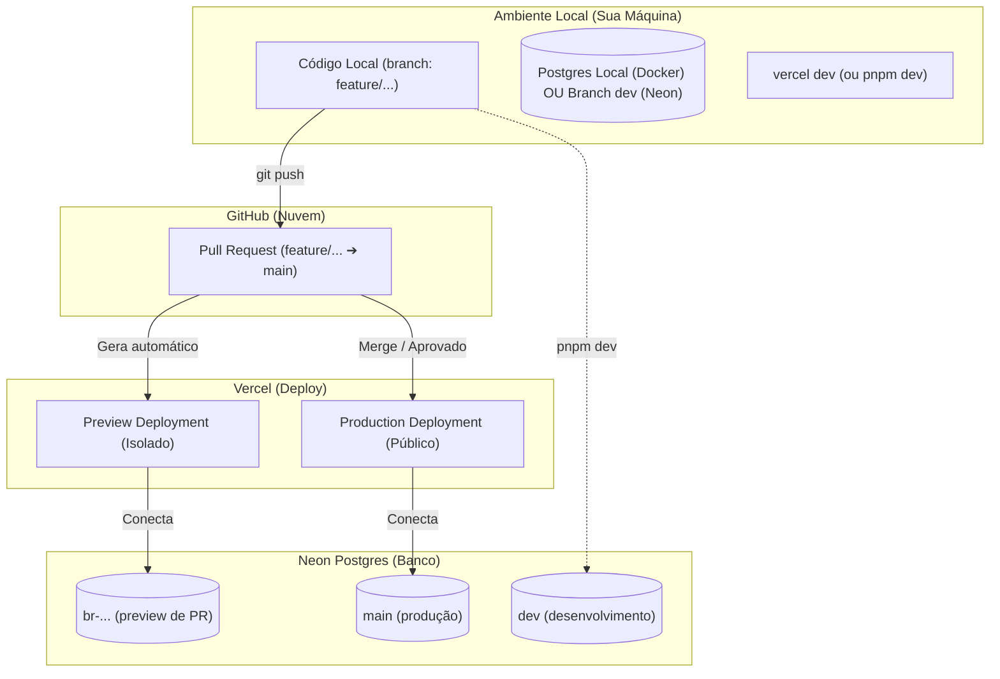

# ⚠️ GUIA LEGADO — Consulte AGENTS.md

> **Este arquivo está obsoleto.** O workflow atual está documentado em
> [`AGENTS.md`](../AGENTS.md) (fonte de verdade única desde 2026-06-08).

---

# Guia de Workflow Sincronizado: Local ⇄ GitHub ⇄ Vercel ⇄ Neon (LEGADO)

> **⚠️ Este guia descreve uma arquitetura antiga com Neon branching para dev.
> A realidade atual usa Docker Postgres local (porta 54320) para desenvolvimento.
> Consulte [`AGENTS.md`](../AGENTS.md) para o estado consolidado.**

---

Este guia explica o fluxo de desenvolvimento do projeto **kayro-gomes**,
integrando desenvolvimento local, deploys de preview, produção e banco
de dados isolados. **Atualizado após diagnosticar e corrigir os "erros
bobos" do ciclo de deploy** — vale a pena ler até o fim antes de clonar.

> **Catálogo de erros comuns:** [`docs/TROUBLESHOOTING.md`](TROUBLESHOOTING.md)

---

## 1. Visão Geral da Arquitetura de Ambientes

| Ambiente | Branch no Git | Vercel Environment | Banco de Dados (Neon) | Armazenamento (Blob) |
| :--- | :--- | :--- | :--- | :--- |
| **Desenvolvimento (Local)** | Qualquer branch (`feature/...`) | `development` (via `.env.local`) | **Branch `dev` do Neon** (essencial!) | Vercel Blob (em desenvolvimento) |
| **Preview (Testes/PR)** | Branch com PR aberto (`feature/...`) | `preview` (dinâmico) | Branch temporária no Neon (criada p/ o PR) | Vercel Blob (Preview) |
| **Produção (Live)** | `main` | `production` | Banco de Produção (`main` do Neon) | Vercel Blob (Produção) |



---

## 2. Pré-requisitos (antes de clonar)

A nuvem (Vercel, GitHub e Neon) já está 100% configurada e sincronizada.
Para rodar local você precisa apenas de:

1.  **Node.js 24.x** — `node -v` deve mostrar `v24.x.x`
2.  **pnpm 10+** — `npm i -g pnpm` (ou via corepack)
3.  **Vercel CLI** — `npm i -g vercel`
4.  **Docker Desktop** *(opcional)* — só se quiser rodar Postgres local sem usar Neon
5.  **neonctl** *(opcional, recomendado)* — `npm i -g neonctl` para gerenciar branches do Neon pelo terminal

Clonar e linkar:
```bash
git clone https://github.com/kayroalexandre/kayro-gomes.git
cd kayro-gomes
vercel link   # conecta o clone ao projeto na Vercel
```

---

## 3. Branch `dev` do Neon (ESSENCIAL)

> **Por que isso é a parte mais importante do workflow:**
> Se você rodar `pnpm dev` contra o banco de produção, o Payload faz
> um "dev push" no schema e cria uma migration com `batch = -1`. Isso
> quebra o `payload migrate` em CI (prompt interativo no build do Vercel)
> e polui a tabela de controle. Detalhes em
> [`docs/TROUBLESHOOTING.md` § 1](TROUBLESHOOTING.md#1-build-do-vercel-trava-num-prompt-do-payload-migrate).

### Setup único (no painel do Neon)

1. Acesse [console.neon.tech](https://console.neon.tech) → projeto `kayro-gomes`
2. Crie um branch chamado `dev` (a partir da `main`):
   - Via painel: **Branches** → **Create Branch** → name: `dev`, parent: `main`
   - Via CLI: `neonctl branches create --name dev --parent main`
3. Copie a **connection string** do branch `dev` (ambos: pooled e direct, igual à prod)
4. Atualize seu `.env.local` com a URL do branch `dev`:
   ```env
   POSTGRES_URL=postgresql://.../neondb?sslmode=require   # ← URL do branch dev
   ```
5. Pronto. Agora `pnpm dev` só mexe no branch `dev`, nunca em prod.

### Quando mexer no schema (criar campo, mudar collection, etc.)

O fluxo correto é:

```bash
# 1. Trabalhar no branch dev do Neon
pnpm dev
#   ↓ ao adicionar/mudar collection, o dev push acontece só no branch dev

# 2. Gerar migration que descreve a mudança
pnpm payload migrate:create add_awesome_field
#   ↓ cria src/migrations/<timestamp>_add_awesome_field.{ts,json}

# 3. Conferir o diff do schema (tem que fazer sentido)
git diff src/migrations/

# 4. Commitar e abrir PR
git add .
git commit -m "feat: add awesome field"
git push origin feature/awesome
```

Quando o PR for mergeado para `main`, o Vercel roda `payload migrate` em
CI, que aplica a nova migration no banco de produção.

---

## 4. Passo a Passo do Workflow

### Passo 1: Desenvolvimento Local
1. Crie uma branch para a tarefa:
   ```bash
   git checkout -b feature/nova-funcionalidade
   ```
2. Baixe as variáveis de ambiente do Vercel (cria `.env.local`):
   ```bash
   vercel env pull
   ```
3. **Troque o `POSTGRES_URL` no `.env.local` para apontar ao branch `dev` do Neon.**
4. Suba o servidor local:
   ```bash
   pnpm dev
   ```
5. Abra `http://localhost:3000` e `http://localhost:3000/admin`.

> *Qualquer alteração que você fizer no banco vai para o branch `dev`,
> nunca em produção. Sem medo de quebrar nada.*

### Passo 2: Preview Colaborativo (PR)
1. Push da branch:
   ```bash
   git add . && git commit -m "feat: ..." && git push origin feature/nova-funcionalidade
   ```
2. Abra PR no GitHub.
3. Vercel + Neon criam **automaticamente**:
   - Um deploy de preview isolado
   - Um branch temporário do banco de dados (snapshot do estado atual)
4. O link do preview aparece como comentário no PR.
5. Use a Vercel Toolbar para deixar comentários e testar.

### Passo 3: Produção
1. Aprove e faça merge do PR na `main`.
2. Vercel dispara deploy de produção.
3. O Vercel roda `pnpm run ci` que executa:
   - `payload migrate` → aplica migrations pendentes no banco prod
   - `pnpm build` → build do Next.js
4. Em ~2 min, a versão nova está no ar.

---

## 5. Alinhamento de Environment Variables

| Variável | Dev Local | Preview | Produção |
| :--- | :--- | :--- | :--- |
| `POSTGRES_URL` | Branch `dev` do Neon | Branch temporário | Branch `main` (prod) |
| `BLOB_READ_WRITE_TOKEN` | Vercel Blob (dev) | Vercel Blob (preview) | Vercel Blob (prod) |
| `PAYLOAD_SECRET` | Mesmo valor (vem do Vercel) | Automático | Automático |
| `CRON_SECRET` | Mesmo valor | Automático | Automático |
| `PREVIEW_SECRET` | Mesmo valor | Automático | Automático |

Para gerar os secrets, use algo como:
```bash
node -e "console.log(require('crypto').randomBytes(32).toString('hex'))"
```

---

## 6. Arquivos de Ambiente — NUNCA commite credenciais

```
.env.example     → commitado, modelo sem valores reais
.env.local       → gitignored, dev local (gerado por `vercel env pull`)
prod.env         → gitignored, prod local (gerado por `vercel env pull --environment=production`)
.env             → se existir, gitignored (legado do docker-compose)
```

> O `.gitignore` deste projeto tem `.env*` na última linha, o que
> ignora qualquer um desses. Confirmado: `git check-ignore` retorna
> match para `.env.local` e `prod.env`.

**Regra de ouro:** se você ver uma string de 40+ chars em hex, é secret.
Não commita, não cola em chat, não sobe em PR.

---

## 7. Scripts Úteis (definidos em `package.json`)

| Comando | O que faz |
| :--- | :--- |
| `pnpm dev` | Inicia o Next.js em modo dev (Turbopack) |
| `pnpm build` | Build de produção |
| `pnpm ci` | `payload migrate && pnpm build` (usado pela Vercel) |
| `pnpm db:check` | Mostra estado da tabela `payload_migrations` |
| `pnpm db:fix-dev-migration` | Limpa dev migrations (`batch=-1`) do banco |
| `pnpm db:seed` | Roda o seed via CLI (precisa blobs limpos) |
| `pnpm payload` | Atalho para o CLI do Payload |
| `pnpm lint` / `pnpm lint:fix` | ESLint |
| `pnpm test:int` / `pnpm test:e2e` | Testes (Vitest + Playwright) |

---

## 8. Comandos do dia a dia

```bash
# Banco de dados
pnpm db:check                           # estado do banco
pnpm db:fix-dev-migration               # limpar batch=-1
pnpm payload migrate:create <nome>      # criar migration
pnpm payload migrate                    # aplicar migrations pendentes
pnpm payload migrate:status             # ver status das migrations

# Vercel
vercel env pull                         # atualizar .env.local com envs de dev
vercel env pull --environment=production # atualizar prod.env com envs de prod
vercel logs <url-do-deploy>             # ver logs de runtime
vercel inspect <url-do-deploy> --logs   # ver logs de build

# Neon (se tiver neonctl instalado)
neonctl branches                        # listar branches
neonctl branches create --name dev      # criar branch dev
neonctl connection-string dev           # ver connection string do dev
```

---

## 9. Quando algo dá errado

1. Rode `pnpm db:check` primeiro — o estado do banco é responsável por 50% dos problemas
2. Veja [`docs/TROUBLESHOOTING.md`](TROUBLESHOOTING.md) — tem a lista de erros mais comuns com a causa e a solução
3. Se for erro de deploy no Vercel, pegue o ID do deploy e rode `vercel inspect <id> --logs`
4. Em último caso, force um deploy limpo: `vercel deploy --force`

---

## 10. Histórico de mudanças deste guia

- **2026-06-07** — Adicionada seção 3 (branch `dev` do Neon) e referências a `docs/TROUBLESHOOTING.md` depois de descobrir que `pnpm dev` contra prod cria o problema do "data loss will occur" no Vercel
- Versão anterior focava em arquitetura geral mas não alertava sobre o anti-padrão de `.env.local` apontando pra prod
