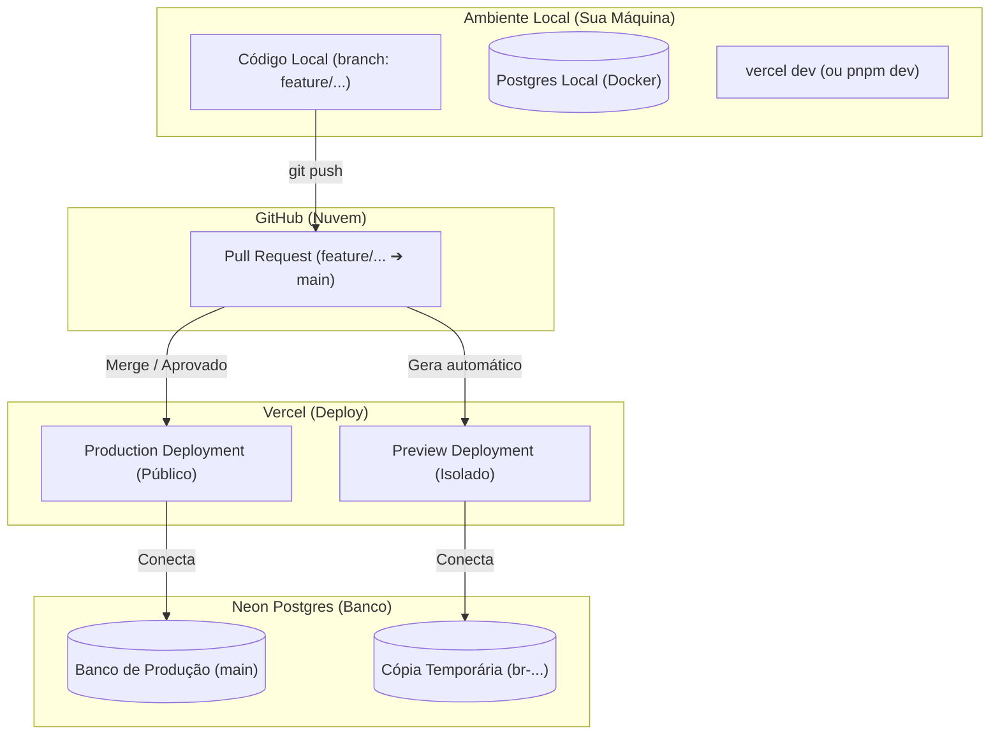

# Guia de Workflow Sincronizado: Local ⇄ GitHub ⇄ Vercel ⇄ Neon

Este guia explica como estruturar de forma ideal o fluxo de desenvolvimento do projeto **kayro-gomes** integrando o desenvolvimento local, deploys de preview (testes) e banco de dados isolados.

---

## 1. Visão Geral da Arquitetura de Ambientes

O fluxo de trabalho ideal é dividido em três ambientes complementares e isolados:

| Ambiente | Branch no Git | Vercel Environment | Banco de Dados (Neon) | Armazenamento (Blob) |
| :--- | :--- | :--- | :--- | :--- |
| **Desenvolvimento (Local)** | Qualquer branch (`feature/...`) | `development` (via `.env.local`) | Postgres Local (Docker) ou Branch `dev` (Neon) | Vercel Blob (em desenvolvimento) |
| **Preview (Testes/PR)** | Branch com PR aberto (`feature/...`) | `preview` (dinâmico) | Branch temporária no Neon (criada p/ o PR) | Vercel Blob (Preview) |
| **Produção (Live)** | `main` | `production` | Banco de Produção (`main` do Neon) | Vercel Blob (Produção) |



---

## 2. Passo a Passo do Fluxo de Trabalho (Workflow)

Quando você for trabalhar no projeto, o ciclo de desenvolvimento seguirá estes passos:

### Passo 1: No seu Computador (Desenvolvimento Local)
1. Crie uma branch para a tarefa:
   ```bash
   git checkout -b feature/nova-funcionalidade
   ```
2. Baixe as variáveis de ambiente do Vercel para a sua máquina (isso criará o arquivo `.env.local` contendo as chaves de desenvolvimento):
   ```bash
   vercel env pull
   ```
3. Suba o banco de dados local com Docker para trabalhar de forma rápida e offline:
   ```bash
   docker-compose up -d
   ```
4. Inicie o servidor local:
   ```bash
   pnpm dev
   ```
   *Qualquer alteração que você fizer no banco de dados local não afetará o ambiente de produção nem os testes.*

### Passo 2: No GitHub e Vercel (Revisão e Preview Colaborativo)
1. Envie sua branch para o GitHub:
   ```bash
   git add .
   git commit -m "feat: adiciona nova funcionalidade"
   git push origin feature/nova-funcionalidade
   ```
2. Abra um **Pull Request (PR)** no GitHub.
3. **Automação Neon + Vercel**: 
   * O Neon cria uma ramificação (branch) instantânea do banco de dados contendo os dados atuais.
   * O Vercel cria uma build isolada (Preview Deployment) conectada a esse banco clonado.
   * O Vercel adiciona um comentário no PR com o link da prévia.
4. **Colaboração (Vercel Toolbar)**: Você e sua equipe abrem o link e usam a barra de ferramentas do Vercel para deixar comentários, testar e aprovar diretamente na tela.

### Passo 3: Publicação (Produção)
1. Ao aprovar o Pull Request no GitHub, faça o **Merge**.
2. O Vercel detecta o merge na branch `main` e atualiza o site de produção em segundos.
3. O banco de dados de produção (`main` do Neon) é atualizado com as novas migrações automaticamente.

---

## 3. Alinhamento de Environment Variables

Para garantir que esse fluxo funcione, as variáveis de ambiente já foram configuradas no Vercel para responder dinamicamente:

*   **`POSTGRES_URL`**: 
    *   No ambiente **Local**, você usará o arquivo `.env.local` apontando para o seu Docker (`postgresql://postgres@localhost:54320/neondb`).
    *   No ambiente **Preview**, o Vercel e o Neon substituem essa variável automaticamente pelo banco de dados temporário gerado para a branch.
    *   No ambiente **Production**, ela aponta para o banco de dados principal no Neon.
*   **`BLOB_READ_WRITE_TOKEN`**: Gerenciado diretamente pelo Vercel. Tanto em Produção quanto em Preview, os arquivos de upload (fotos, mídias) irão para o Vercel Blob de forma transparente.
*   **`PAYLOAD_SECRET`**, **`CRON_SECRET`**, **`PREVIEW_SECRET`**: Já estão configuradas no painel do Vercel para proteger a autenticação do seu CMS em todos os deploys.

---

## 4. O que fazer antes de Clonar o Projeto Localmente?

Como a nuvem (Vercel, GitHub e Neon) já está 100% configurada e sincronizada, os requisitos para você começar na sua máquina local são apenas:

1.  **Ter o Docker instalado**: Necessário para rodar o banco localmente de forma simples sem precisar instalar o Postgres diretamente na sua máquina.
2.  **Ter o Node.js (v24+) e pnpm instalados**: Para rodar o Next.js.
3.  **Instalar a Vercel CLI**:
    ```bash
    npm install -g vercel
    ```
4.  **Clonar e Linkar**:
    ```bash
    git clone https://github.com/kayroalexandre/kayro-gomes.git
    cd kayro-gomes
    vercel link # Para conectar o seu clone local ao projeto na nuvem do Vercel
    ```
